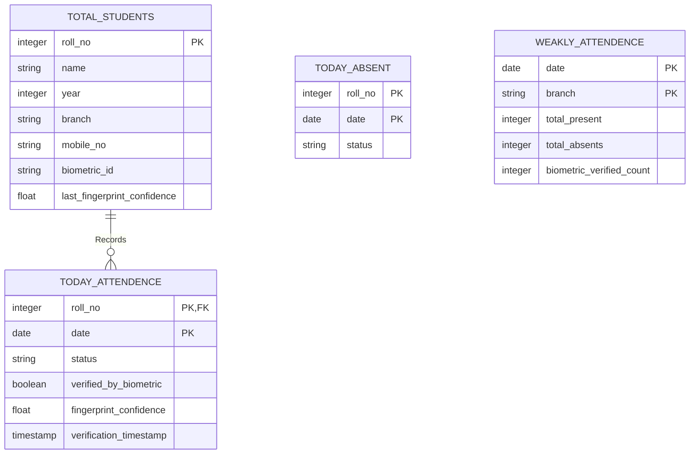
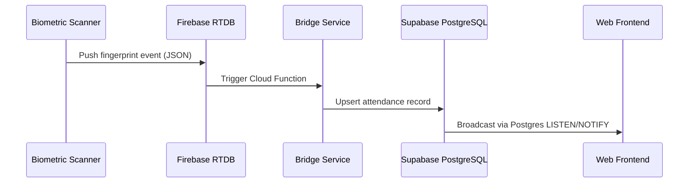
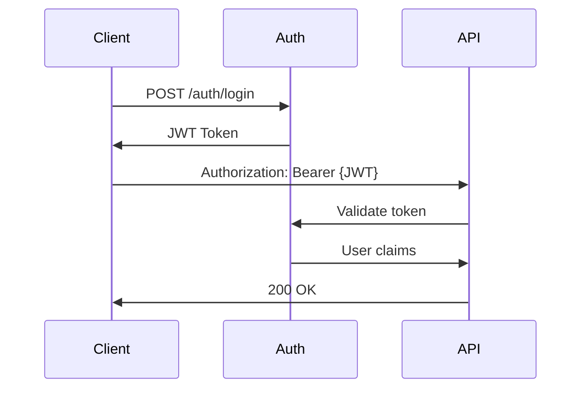

# Attendance Management System - Technical Documentation

## System Architecture

### Overview
The Attendance Management System is a modern, full-stack application that combines biometric authentication, real-time data synchronization, and automated notifications. The system is built using a microservices architecture pattern, with clear separation between the frontend, backend API, and database layers.

### Technology Stack

#### Frontend Technologies
1. **React.js with TypeScript**
   - Framework: React 18+ with TypeScript for type safety
   - Build Tool: Vite.js for fast development and optimized builds
   - State Management: React Hooks and Context API
   - UI Components: Custom components with Tailwind CSS
   - Animations: Framer Motion for smooth transitions

2. **UI Libraries and Tools**
   - Tailwind CSS for utility-first styling
   - Lucide React for modern icons
   - Recharts for data visualization
   - Papa Parse for CSV data handling

#### Backend Technologies
1. **Python REST API**
   - Framework: Flask for lightweight API endpoints
   - CORS handling for cross-origin requests
   - Real-time data sync using WebSocket connections

2. **Database**
   - Primary Database: PostgreSQL (via Supabase)
   - Real-time Database: Firebase Realtime Database
   - Database Bridge: Custom Python service for synchronization

3. **External Services**
   - Twilio API for SMS notifications
   - Firebase Admin SDK for real-time updates
   - Supabase Client for database operations

### Database Schema



**Index Optimization**
```sql
CREATE INDEX idx_attendance_date ON today_attendence USING BRIN(date);
CREATE INDEX idx_students_biometric ON total_students USING HASH(biometric_id);
```

#### 1. total_students
```sql
CREATE TABLE total_students (
    roll_no SERIAL PRIMARY KEY,
    name TEXT NOT NULL,
    year INT NOT NULL,
    branch TEXT NOT NULL,
    mobile_no TEXT NOT NULL,
    biometric_id TEXT UNIQUE,
    last_fingerprint_confidence FLOAT
);
```

#### 2. today_attendence
```sql
CREATE TABLE today_attendence (
    roll_no INT REFERENCES total_students(roll_no),
    name TEXT NOT NULL,
    year INT NOT NULL,
    branch TEXT NOT NULL,
    status TEXT CHECK (status IN ('Present', 'Absent')),
    date DATE DEFAULT CURRENT_DATE,
    verified_by_biometric BOOLEAN DEFAULT false,
    fingerprint_confidence FLOAT,
    verification_timestamp TIMESTAMP DEFAULT CURRENT_TIMESTAMP,
    PRIMARY KEY (roll_no, date)
);
```

#### 3. today_absent
```sql
CREATE TABLE today_absent (
    roll_no INT,
    name TEXT NOT NULL,
    mobile_no TEXT NOT NULL,
    branch TEXT NOT NULL,
    status TEXT CHECK (status = 'Absent'),
    date DATE DEFAULT CURRENT_DATE,
    PRIMARY KEY (roll_no, date)
);
```

#### 4. weakly_attendence
```sql
CREATE TABLE weakly_attendence (
    date DATE DEFAULT CURRENT_DATE,
    branch TEXT NOT NULL,
    total_present INT DEFAULT 0,
    total_absents INT DEFAULT 0,
    biometric_verified_count INT DEFAULT 0,
    PRIMARY KEY (date, branch)
);
```

### Core Algorithms

#### 1. Biometric Verification Process
```python
def mark_biometric_attendance(fingerprint_id: str, confidence: float) -> dict:
    """
    Processes biometric verification with device SDK integration
    Args:
        fingerprint_id: Hexadecimal fingerprint template
        confidence: Match confidence score (0.0-1.0)
    Returns:
        Attendance record with verification metadata
    """
    try:
        # Initialize device SDK
        with BiometricDeviceSDK(ip=config.DEVICE_IPS) as scanner:
            # 1. Validate fingerprint template
            template_validation = scanner.validate_template(fingerprint_id)
            
            if template_validation['is_valid']:
                # 2. Match with student records
                student = supabase_client.table('total_students')
                    .select('*')
                    .eq('biometric_id', fingerprint_id)
                    .single()
                    .execute()

                # 3. Create attendance record
                attendance_record = {
                    'roll_no': student['roll_no'],
                    'confidence_score': confidence,
                    'device_id': scanner.device_id,
                    'verification_timestamp': datetime.utcnow().isoformat()
                }
                
                # 4. Publish real-time update
                redis_client.publish('attendance_updates', 
                    json.dumps(attendance_record))
                
                return attendance_record
    except DeviceConnectionError as e:
        logger.error(f"Biometric device error: {str(e)}")
        raise AttendanceException("DEVICE_CONNECTION_FAILURE")

#### 2. Attendance Aggregation

**Database Triggers**
```sql
CREATE OR REPLACE FUNCTION update_daily_aggregates()
RETURNS TRIGGER AS $$
BEGIN
    INSERT INTO weakly_attendence (date, branch, total_present, total_absents)
    VALUES (NEW.date, NEW.branch, 
        (SELECT COUNT(*) FROM today_attendence 
         WHERE status = 'Present' AND date = NEW.date),
        (SELECT COUNT(*) FROM today_absent 
         WHERE date = NEW.date))
    ON CONFLICT (date, branch) DO UPDATE
    SET total_present = EXCLUDED.total_present,
        total_absents = EXCLUDED.total_absents;
    RETURN NEW;
END;
$$ LANGUAGE plpgsql;

CREATE TRIGGER attendance_aggregation
AFTER INSERT ON today_attendence
FOR EACH ROW EXECUTE FUNCTION update_daily_aggregates();
```

**Analytics Pipeline**
```python
async def calculate_branch_stats():
    """Generates branch-wise attendance patterns using window functions"""
    return await supabase_client.rpc('calculate_branch_stats', {
        'window_size': '7 days',
        'threshold': 0.85
    })
```

#### 3. SMS Notification System
```python
def send_sms(phone_number, message_text):
    # 1. Format phone number to E.164
    # 2. Validate against Twilio verified numbers
    # 3. Send SMS with error handling
    # 4. Log delivery status
```

### Real-time Synchronization

#### Firebase-Supabase Bridge
1. **Data Flow**


2. **Implementation Details**
```python
# Bridge service core logic
async def sync_worker():
    firebase_ref = db.reference('/scanner_events')
    firebase_ref.listen(on_snapshot)

async def on_snapshot(event):
    if event.data:
        validated = validate_scanner_data(event.data)
        if validated:
            await supabase_client.table('raw_events').insert(validated)
            await supabase_client.rpc('process_attendance', {'event_id': validated['id']})
```

3. **Error Handling**
   - Exponential backoff retry (max 5 attempts)
   - Schema validation using Pydantic models
   - Dead letter queue for failed events
   - Prometheus metrics for monitoring

### Frontend Architecture

#### 1. Component Structure
- Atomic design pattern
- Reusable UI components
- Custom hooks for business logic

#### 2. State Management
```typescript
// Example state hooks
const [dateRange, setDateRange] = useState("This Week");
const [courseData, setCourseData] = useState([]);
const [dailyAggregates, setDailyAggregates] = useState({});
```

#### 3. Data Visualization
- Bar charts for daily attendance
- Pie charts for branch distribution
- Real-time statistics cards

### Security Measures

**Authentication Flow**


**Data Encryption**
```python
# Biometric data encryption example
from cryptography.hazmat.primitives.ciphers.aead import AESGCM

def encrypt_biometric_data(data: bytes, key: bytes) -> bytes:
    nonce = os.urandom(12)
    aesgcm = AESGCM(key)
    ct = aesgcm.encrypt(nonce, data, None)
    return nonce + ct
```

1. **Authentication**
   - Role-based access control
   - Secure session management
   - API key protection

2. **Data Protection**
   - Encrypted biometric data
   - Secure SMS gateway
   - Database access controls

### Performance Optimization

1. **Frontend**
   - Code splitting and lazy loading
   - Optimized re-renders
   - Cached API responses

2. **Backend**
   - Database indexing
   - Query optimization
   - Connection pooling

### Deployment Architecture

1. **Frontend Deployment**
   - Static hosting on CDN
   - Environment configuration
   - Build optimization

2. **Backend Services**
   - Containerized deployment
   - Load balancing
   - Auto-scaling

### Monitoring and Logging

1. **Application Monitoring**
   - Error tracking
   - Performance metrics
   - User analytics

2. **Database Monitoring**
   - Query performance
   - Connection pools
   - Storage utilization

### Future Enhancements

1. **Planned Features**
   - Mobile application
   - Advanced analytics
   - Multi-campus support

2. **Technical Improvements**
   - GraphQL API
   - Machine learning integration
   - Enhanced security measures

### Development Guidelines

1. **Code Standards**
   - TypeScript for type safety
   - ESLint configuration
   - Git workflow

2. **Testing Strategy**
   - Unit testing with Jest
   - Integration testing
   - E2E testing with Cypress

### Maintenance Procedures

1. **Regular Tasks**
   - Database backups
   - Log rotation
   - Security updates

2. **Emergency Procedures**
   - System recovery
   - Data restoration
   - Incident response

### API Documentation

**Example Request/Response**

```http
POST /api/attendance HTTP/1.1
Content-Type: application/json
Authorization: Bearer {JWT}

{
    "roll_no": 1024,
    "status": "Present",
    "verified_by_biometric": true
}

HTTP/1.1 201 Created
{
    "id": "a1b2c3d4",
    "roll_no": 1024,
    "timestamp": "2024-01-20T15:22:34Z",
    "confidence_score": 0.92,
    "device_id": "scanner-05"
}
```

**Error Responses**
```http
HTTP/1.1 401 Unauthorized
{
    "error": "invalid_token",
    "error_description": "Expired JWT token"
}

HTTP/1.1 422 Unprocessable Entity
{
    "errors": {
        "status": ["must be either 'Present' or 'Absent'"]
    }
}
```

#### 1. Attendance Endpoints
```typescript
// Record attendance
POST /api/attendance
Body: {
  roll_no: number,
  status: 'Present' | 'Absent',
  verified_by_biometric: boolean
}

// Get attendance report
GET /api/attendance/report
Query: {
  start_date: string,
  end_date: string,
  branch?: string
}
```

#### 2. SMS Notification Endpoints
```typescript
// Send absence notification
POST /api/send-sms
Body: {
  mobile_no: string,
  message: string,
  roll_no: string
}
```

### Configuration Management

1. **Environment Variables**
```env
DATABASE_URL=postgresql://...
SMS_API_KEY=your_twilio_key
BIOMETRIC_DEVICE_IPS=192.168.1.100,192.168.1.101
```

2. **Feature Flags**
```typescript
const FEATURES = {
  BIOMETRIC_ENABLED: true,
  SMS_NOTIFICATIONS: true,
  REAL_TIME_UPDATES: true
};
```

### Troubleshooting Guide

1. **Common Issues**
   - Biometric device connectivity
   - SMS delivery failures
   - Database synchronization

2. **Resolution Steps**
   - Diagnostic procedures
   - Recovery processes
   - Escalation matrix

### System Requirements

1. **Hardware Requirements**
   - Biometric scanner specifications
   - Server requirements
   - Network bandwidth

2. **Software Requirements**
   - Node.js 16+
   - Python 3.8+
   - PostgreSQL 13+

### Backup and Recovery

1. **Backup Strategy**
   - Daily database backups
   - Configuration backups
   - Disaster recovery plan

2. **Recovery Procedures**
   - Data restoration
   - System recovery
   - Service continuity

### Compliance and Security

1. **Data Protection**
   - Personal data handling
   - Biometric data security
   - Access controls

2. **Audit Trails**
   - System access logs
   - Data modifications
   - Security events

### Support and Contact

1. **Technical Support**
   - Issue reporting
   - Feature requests
   - Bug tracking

2. **Emergency Contacts**
   - System administrators
   - Database administrators
   - Security team